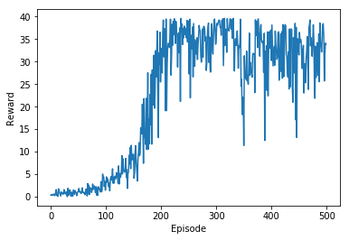

# Continous Control Operation using Deep Reinforcement Learning Agent

In this project, an agent has been trained on a continous space operation using Reinforcement Learning algorithm to hold the moving target using a double-joined arm. The goal of the agent is to maintain the double-joined arm location at the target location (a moving ball in this case), for as many time steps as possible.

## The Environment

Unity's framework's Reacher environment has been used to simulate the environment. The observation space consists of 33 variables corresponding to position, rotation, velocity, and angular velocities of the arm. Each action is a vector with four numbers, corresponding to torque applicable to two joints.

## The Agent

An agent's task is to maintain the double-joined arm location at the target location, for as many time steps as possible. 

The observation space consists of 33 variables corresponding to position, rotation, velocity, and angular velocities of the arm. Each action is a vector with four numbers, corresponding to torque applicable to two joints. Every entry in the action vector should be a number between -1 and 1.

The environment is considered solved, when the average (over 100 episodes) of those average scores is at least +30. 

## The Learning

To train the agent for navigation, Deep Deterministic Policy Gradeint (DDPG) learning has been applied, using Stochastic Actor-Critic (SAC). DDPG is an algorithm which concurrently learns a Q-function and a policy. It uses off-policy data and the Bellman equation to learn the Q-function, and uses the Q-function to learn the policy. SAC represents the policy as a parametric probability distribution (stochastic approach)πθ(a|s)=Pr(a|s;θ), by incorporating stochastic gradient policy as:

∇θV(πθ)=Es∼ρπ,a∼πθ[∇θlogπθ(a|s)Qπ(s,a)]

It calculates the expected gradient of the log-likelihood of the Qπ value if we start from the state sand act according to the policy πθ with respect to parameters θ.

Agent's DQN Network archicteture and hyperparameters are as below: 

1. Actor: StateSpace x HiddenLayer1 x HiddenLayer2 x ActionSpace, with 64 neurons in each hidden layer. RELU activation for hidden layer and Tanh activation for output layer for a continous space output in the range (-1, 1).
2. Critic: StateSpace x HiddenLayer1 x (HiddenLayer2 + ActionSpace) x ActionSpace, with 64 neurons in each hidden layer and relu activation. 
3. Experience Replay memory buffer of 1e5.
4. Batch update on experience replay of 64 experiences.
5. Discount factor set to 0.99.
6. Soft update for target DQN update factor of 1e-3.
7. Network learning rate set to 5e-4.
8. Target network parameters update at every 4 steps.
9. Min Rewards threshold for agent is +30.

## Results

Trained agent has reported on average +35 points over 100 consecutive episodes. Agent was trained with 5,00 episodes. Graph below shows the learning curve of the agent over episodes.

## Future Enhancements

Current implementation solves the problem where a single agent is interacting with the environment. Project can be further enhanced to solve the second version of the environment which has 20 identical agents operating in the environment, simultaneously. With simultaneous interaction with environment, these agents can share the experience, which can help in accelerating learning for an agent.