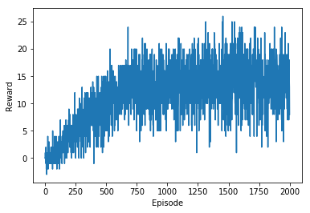

# Navigation using Deep Reinforcement Learning Agent

In this project, an agent has been trained using Reinforcement Learning algorithm to navigate an environment that has yellow and blue banans. The task for agent is to collect yellow bananas (as many as possible) and avoid blue bananas.

## The Environment

Unity's framework's Banana Navigator environment has been used to simulate the environment. State space of the environment has 37 dimensions and contains agent's velocity, along with ray based perception of the objects around agent's forward direction.

## The Agent

An agent's task is to navigate the Banana world and collect yellow bananas (as many as possible) while avoiding blue bananas. An agent has four possible actions available: 

- Move Forward
- Move Backward
- Turn Left 
- Turn Right

Each navigation is episodic (i.e. task will terminate at certain steps) and a trained agent is expected to achieve an average score of +13. 

## The Learning

To train the agent for navigation, Deep Reinforcement Learning has been applied. To find the optimial navigation policy, Deep-Q-Networks (DQN) has been placed to approximate the Q-values for each action based on environment's state. DQNs are most effective replacements of Q-table for larger state spaces. 

DQN and it's architecture was first introduced by DeepMind in training an agent to play Atari games. The paper can be found [here](https://storage.googleapis.com/deepmind-media/dqn/DQNNaturePaper.pdf)

To train the agent, similar DQN algorithm has been used with two modifications - 

- Fixed Q-Targets
- Experience Replay

Fixed Q-Targets helps in avoiding the correlation between temporal difference target and estimated Q values. Experience replay allows remembering past experiences that agent has encountered while navigating the environment and learns from that experience at later point of time using replay.

DQN Network archicteture and hyperparameters are as below: 

1. StateSpace x HiddenLayer1 x HiddenLayer2 x ActionSpace, with 64 neurons in each hidden layer and relu activation. 
2. Experience Replay memory buffer of 1e5.
3. Batch update on experience replay of 64 experiences.
4. Discount factor set to 0.99.
5. Soft update for target DQN update factor of 1e-3.
6. Network learning rate set to 5e-4.
7. Target network parameters update at every 4 steps.
8. Min Rewards threshold for agent is 14. 

## Results

Trained agent has reported on average +15 points over 100 consecutive episodes. Agent was trained with 2,000 episodes. Graph below shows the learning curve of the agent over episodes.

## Future Enhancements

Agent's learning can be further improved by following impelenations: 

1. By improving Neural Network's architecture for DQNs
2. Double DQNS to control overestimation of Q-values
3. Dueling the Q-Nework to separate the estimators for state and next value state's Q-values
4. Prioritize the experience replay by giving higher priorities to rare experiences.