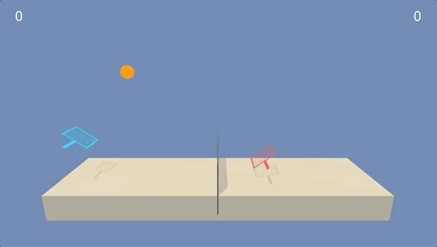

# Multi Agent Control Operation using Deep Reinforcement Learning

This project demonstrates the Deep Reinforcement Learning abilities to collaborate multiple agents in a single operating environment. There are number of important applications that involve interactiion between multiple agents, where emergent behaviour and complexity arise from agents co-evolving together. 

In this project, two agents have been trained to play the Tennis tournament using Reinforcement Learning algorithm to play the  game, with each agent acting as one of the players. These two agents control rackets to bounce the ball over a net, with aim to keep the ball in the play, for as many time steps as possible. 

## The Environment

Unity's framework's Tennis environment has been used to simulate the environment.

## The Agents

Two agents control rackets to bounce the ball over a net. If an agent hits the ball over the net, it receives reward of +0.1 and a reward of -0.01 is given if an agent lets the ball hit the ground or hits the ball out of bounds. Thus goal for both agents is to keep the ball in play, for as many time steps as possible.

The observation space consists of 8 variables corresponding to the position and velocity of the ball and racket. Each agent receives its own, local observation. Two continous actions are available, corresponding to movement toward (or away from) the net, and jumping.

The environment is considered solved, when the average (over 100 episodes) of those average scores is at least +0.50. 

## Getting Started

Make sure you have `python 3.6` installed under your virtual environment, along with Unity framework. To install dependencies, open the 'Tennis.ipynb' notebook and run first cell.

!pip -q install ./python

## Code Structure

To start running the project, open and run the notebook 'Tennis.ipynb'. Structure of the code as is below:

1. qnetwork.py: this file implements the multi agent players using Deep Deterministic Policy Gradeint (DDPG) algorithm.

2. player.py: training of agents is controlled from this file

3. Tennis.ipynb: notebook has trained network and it's results.
 
4. 'checkpoint_actor0.pth': player-1 actor's trained network's parameters which an agent can restore it's memory using player.restore_memory function.

5. 'checkpoint_critic0.pth': player-1 critic's trained network's parameters which an agent can restore it's memory using player.restore_memory function.

6. 'checkpoint_actor1.pth': player-2 actor's trained network's parameters which an agent can restore it's memory using player.restore_memory function.

7. 'checkpoint_critic1.pth': player-2 critic's trained network's parameters which an agent can restore it's memory using player.restore_memory function.
