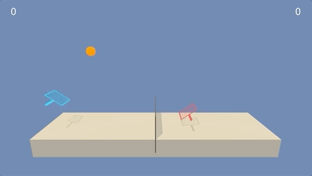
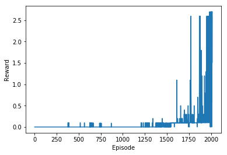

# Multi Agent Control Operation using Deep Reinforcement Learning

This project demonstrates the Deep Reinforcement Learning abilities to collaborate multiple agents in a single operating environment. There are number of important applications that involve interactiion between multiple agents, where emergent behaviour and complexity arise from agents co-evolving together. 

In this project, two agents have been trained to play the Tennis tournament using Reinforcement Learning algorithm to play the  game, with each agent acting as one of the players. These two agents control rackets to bounce the ball over a net, with aim to keep the ball in the play, for as many time steps as possible.

## The Environment

Unity's framework's Tennis environment has been used to simulate the environment.

## The Agents

Two agents control rackets to bounce the ball over a net. If an agent hits the ball over the net, it receives reward of +0.1 and a reward of -0.01 is given if an agent lets the ball hit the ground or hits the ball out of bounds. Thus goal for both agents is to keep the ball in play, for as many time steps as possible.

The observation space consists of 8 variables corresponding to the position and velocity of the ball and racket. Each agent receives its own, local observation. Two continous actions are available, corresponding to movement toward (or away from) the net, and jumping.

The environment is considered solved, when the average (over 100 episodes) of those average scores is at least +0.50. 

## The Learning

To train two agents for tennis game, Deep Deterministic Policy Gradeint (DDPG) learning has been applied, using Stochastic Actor-Critic (SAC). DDPG is an algorithm which concurrently learns a Q-function and a policy. It uses off-policy data and the Bellman equation to learn the Q-function, and uses the Q-function to learn the policy. SAC represents the policy as a parametric probability distribution (stochastic approach)πθ(a|s)=Pr(a|s;θ), by incorporating stochastic gradient policy as:

∇θV(πθ)=Es∼ρπ,a∼πθ[∇θlogπθ(a|s)Qπ(s,a)]

It calculates the expected gradient of the log-likelihood of the Qπ value if we start from the state sand act according to the policy πθ with respect to parameters θ.

Each agent's DQN Network archicteture and hyperparameters are as below:

1. Actor: StateSpace x HiddenLayer1 x HiddenLayer2 x ActionSpace, with 512 neurons in first layer and 256 neurons in second layer, with RELU activation for hidden layer and Tanh activation for output layer for a continous space output in the range (-1, 1).
2. Critic: StateSpace x HiddenLayer1 x (HiddenLayer2 + ActionSpace) x ActionSpace, with 512 neurons in first layer and 256 neurons in second layer, with RELU activation for each layer.
3. Experience Replay memory buffer of 1e7.
4. Batch update on experience replay of 64 experiences.
5. Discount factor set to 0.99.
6. Soft update for target DQN update factor of 5e-3.
7. Network learning rate set to 7e-4.
8. Target network parameters update at every 8 steps.
9. Min Rewards threshold for agent is +0.50.

### Shared Experience

During training, each agent has shared it's own experience with the other agent. So, each time play records two memory buffer for each agent - one for it's own experience and other one for opponent's experience. This boosts the learning process for both agents as they may not necessarily have to encounter the experience before they can learn it.

### Batched Training with Memory Retention

Multi agent systems are known for the instability during training. As an experiment, I devided the training process into two batches with 1500 episodes each. Once the first batch was completed for 1,500 episodes, agents started fresh with next batch of 1,500 episodes. Theoretically, this gives both agents two opportunities for exploration and exploitation (when second batch starts, randomness in actions (epsilon) is high). Results have shown that second batch training obtained much stable results as compared to traning agents with 3,000 episodes together.

## Results

Trained agent has reported on average +1.02 points over 100 consecutive episodes. Training was stopped at the maximum threshold of 1.0. Both agents have been trainied with two batches of 1,500 episodes each. Graph below shows the learning curve of the agent over episodes.

## Future Enhancements

Learning for both agents can be further improved by following impelenations:

1. By improving Neural Network's architecture for DQNs
2. Double DQNS to control overestimation of Q-values
3. Dueling the Q-Nework to separate the estimators for state and next value state's Q-values
4. Prioritize the experience replay by giving higher priorities to rare experiences.